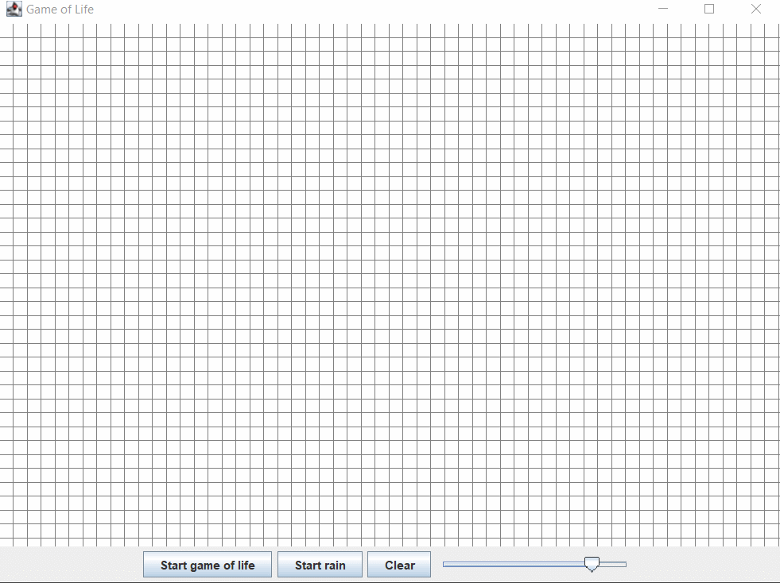

### Important

These small projects made for Modeling of Discrete Event Systems course at AGH UST.  Part of the code is written by my teacher.

#### Game of life

rules: https://en.wikipedia.org/wiki/Conway%27s_Game_of_Life

#### Sound simulation

- white - create a sound wave
- red - wall that stops the sound
- green - create a sound wave periodically

